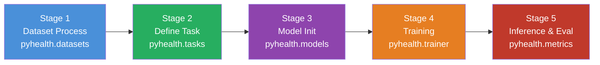
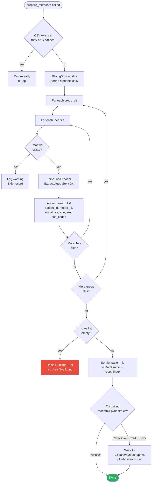
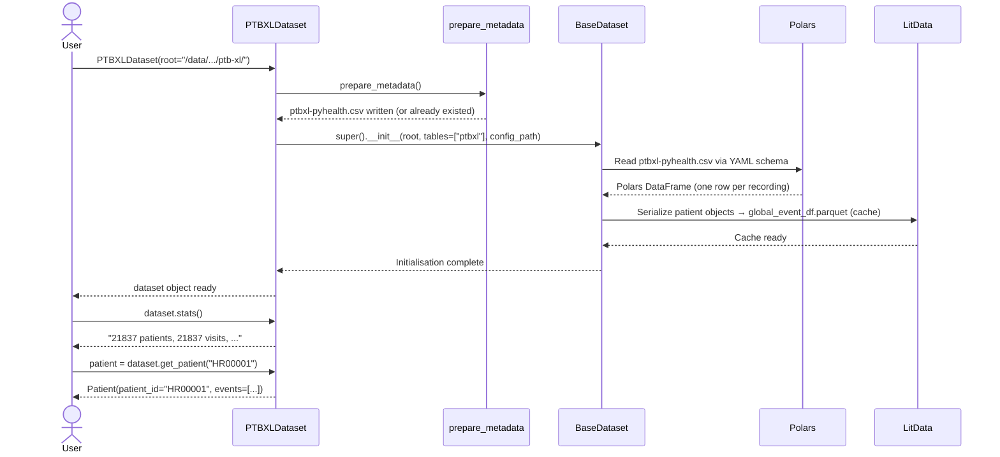
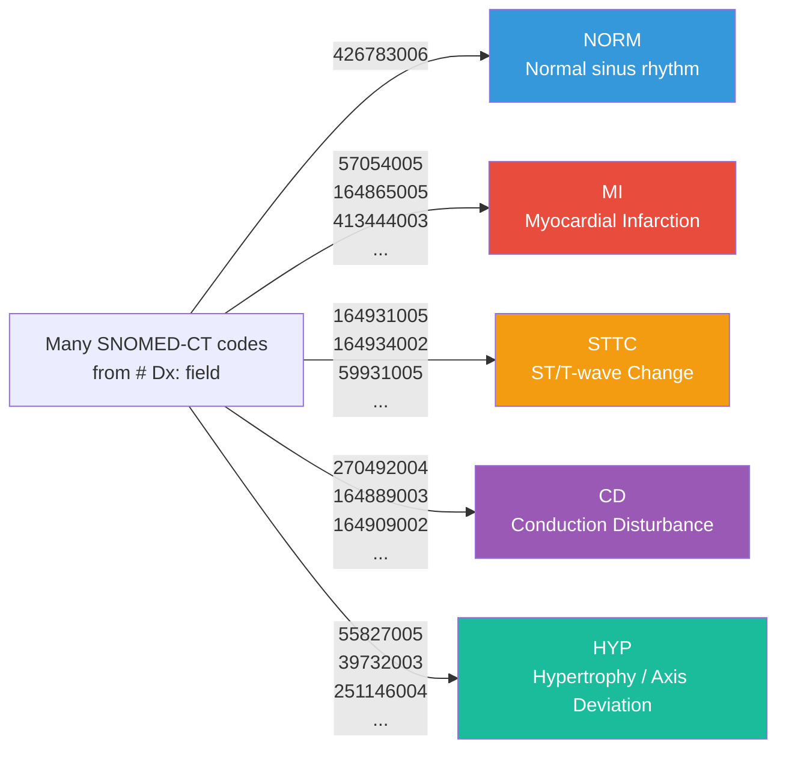
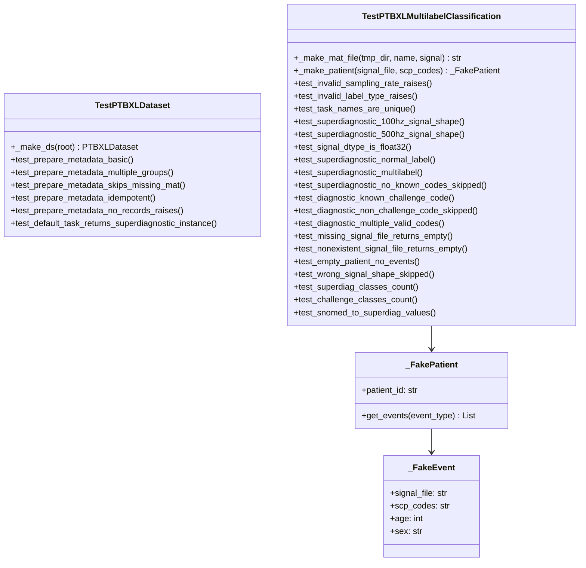
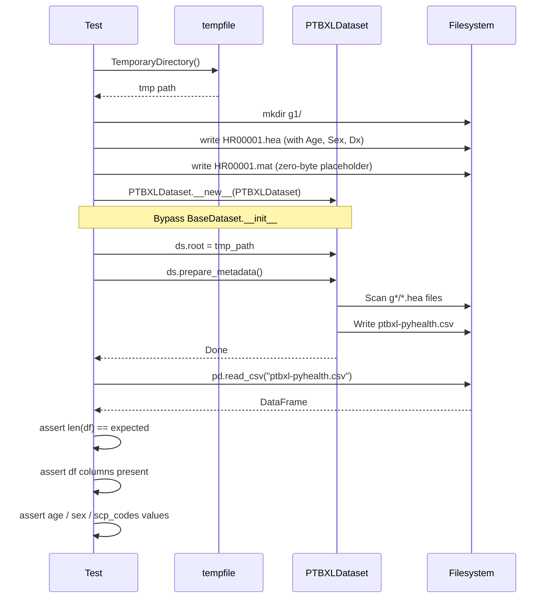
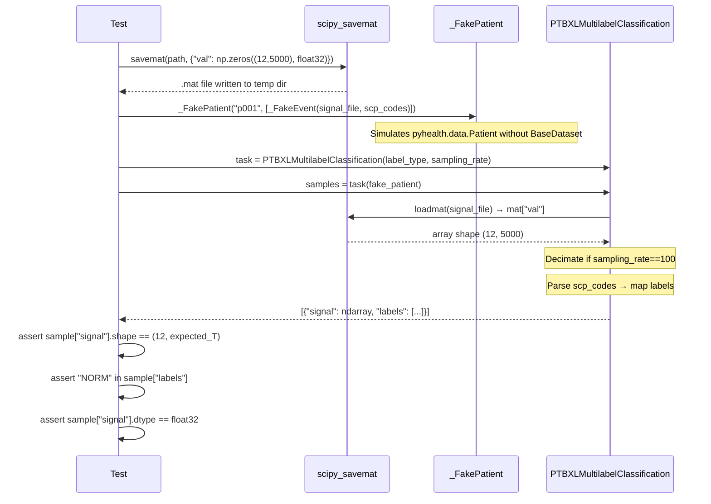
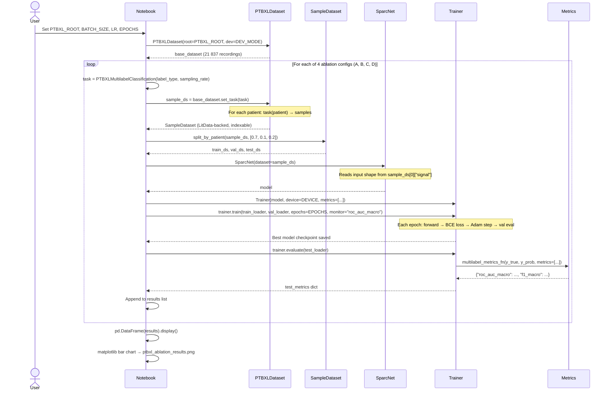
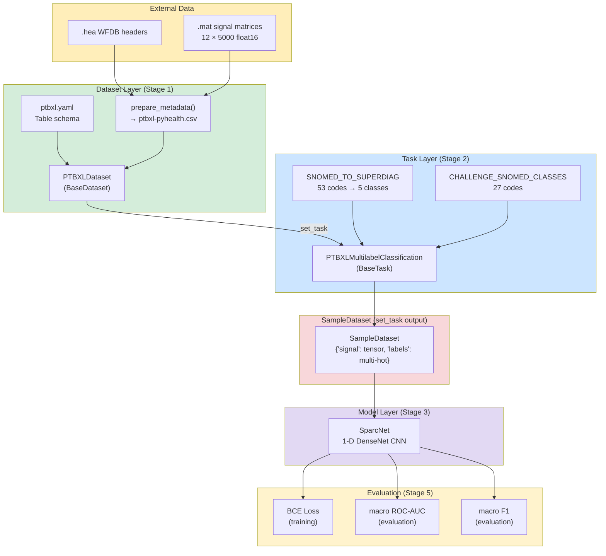

# PTB-XL ECG Classification — Complete Implementation Guide

**Course:** CS-598 Deep Learning for Healthcare  
**Project:** PTB-XL Dataset + Multi-Label Task integration into PyHealth 2.0  
**Stack:** Python ≥ 3.12 · PyTorch 2.7 · PyHealth 2.0  

---

## Table of Contents

1. [Project Overview](#1-project-overview)
2. [Repository File Map](#2-repository-file-map)
3. [PyHealth 5-Stage Pipeline](#3-pyhealth-5-stage-pipeline)
4. [Stage 1 — Dataset Implementation](#4-stage-1--dataset-implementation)
   - 4.1 [YAML Config](#41-yaml-config-pyhealth.datasets.configs.ptbxl.yaml)
   - 4.2 [PTBXLDataset Class](#42-ptbxldataset-class)
   - 4.3 [prepare_metadata Flow](#43-preparemetadata-flow)
   - 4.4 [Header Parsing](#44-header-parsing)
   - 4.5 [Dataset → BaseDataset Sequence](#45-dataset--basedataset-sequence)
5. [Stage 2 — Task Implementation](#5-stage-2--task-implementation)
   - 5.1 [Label Space Definitions](#51-label-space-definitions)
   - 5.2 [PTBXLMultilabelClassification Class](#52-ptbxlmultilabelclassification-class)
   - 5.3 [\_\_call\_\_ Flow per Patient](#53-__call__-flow-per-patient)
   - 5.4 [Decimation: 500 Hz → 100 Hz](#54-decimation-500-hz--100-hz)
6. [Mathematical Framing](#6-mathematical-framing)
   - 6.1 [Signal Representation](#61-signal-representation)
   - 6.2 [Forward Pass](#62-forward-pass)
   - 6.3 [Loss Function](#63-loss-function)
   - 6.4 [Evaluation Metrics](#64-evaluation-metrics)
7. [Ablation Study Design](#7-ablation-study-design)
8. [Module Registration (\_\_init\_\_ imports)](#8-module-registration-__init__-imports)
9. [Documentation (RST + toctree)](#9-documentation-rst--toctree)
10. [Test Suite](#10-test-suite)
    - 10.1 [Test Architecture](#101-test-architecture)
    - 10.2 [Dataset Tests](#102-dataset-tests)
    - 10.3 [Task Tests](#103-task-tests)
11. [Example Notebook — Ablation Study](#11-example-notebook--ablation-study)
    - 11.1 [End-to-End Pipeline Sequence](#111-end-to-end-pipeline-sequence)
12. [Data Layout](#12-data-layout)
13. [Dependency Graph](#13-dependency-graph)
14. [References](#14-references)

---

## 1. Project Overview

PTB-XL is the largest openly available clinical 12-lead ECG dataset (21,837 recordings, 18,885 patients, Charité Hospital Berlin). This project integrates it fully into the **PyHealth 2.0** framework by implementing:

| Deliverable | File | Purpose |
|---|---|---|
| Dataset class | `pyhealth/datasets/ptbxl.py` | Parse raw WFDB files into PyHealth patient records |
| YAML schema | `pyhealth/datasets/configs/ptbxl.yaml` | Tell BaseDataset which columns to load |
| Task class | `pyhealth/tasks/ptbxl_multilabel_classification.py` | Convert patient records to ML samples |
| Dataset RST | `docs/api/datasets/pyhealth.datasets.PTBXLDataset.rst` | Sphinx API doc for dataset |
| Task RST | `docs/api/tasks/pyhealth.tasks.PTBXLMultilabelClassification.rst` | Sphinx API doc for task |
| datasets.rst entry | `docs/api/datasets.rst` (line 241) | toctree link to dataset doc |
| tasks.rst entry | `docs/api/tasks.rst` (line 232) | toctree link to task doc |
| Test file | `tests/core/test_ptbxl.py` | 18 offline unit tests |
| Example notebook | `examples/ptbxl_superdiagnostic_sparcnet.ipynb` | Ablation study |

---

## 2. Repository File Map

```
PyHealth/
├── pyhealth/
│   ├── datasets/
│   │   ├── __init__.py          ← imports PTBXLDataset
│   │   ├── ptbxl.py             ← ★ Dataset implementation
│   │   ├── base_dataset.py      ← Parent class (LitData + Polars backend)
│   │   └── configs/
│   │       └── ptbxl.yaml       ← ★ YAML schema
│   ├── tasks/
│   │   ├── __init__.py          ← imports PTBXLMultilabelClassification
│   │   ├── ptbxl_multilabel_classification.py  ← ★ Task implementation
│   │   └── base_task.py         ← Parent class
│   └── models/
│       └── sparcnet.py          ← Model used in ablation
├── docs/api/
│   ├── datasets.rst             ← ★ toctree entry added
│   ├── tasks.rst                ← ★ toctree entry added
│   ├── datasets/
│   │   └── pyhealth.datasets.PTBXLDataset.rst   ← ★ Dataset doc
│   └── tasks/
│       └── pyhealth.tasks.PTBXLMultilabelClassification.rst  ← ★ Task doc
├── tests/core/
│   └── test_ptbxl.py            ← ★ Unit tests (18 cases)
└── examples/
    └── ptbxl_superdiagnostic_sparcnet.ipynb  ← ★ Ablation notebook
```

---

## 3. PyHealth 5-Stage Pipeline

Every PyHealth 2.0 project follows a strictly ordered 5-stage pipeline. The boxes in **bold** are where our code lives.



| Stage | API | Our contribution |
|---|---|---|
| 1 Dataset Process | `pyhealth.datasets.PTBXLDataset` | Parses WFDB `.hea`/`.mat` files |
| 2 Define Task | `pyhealth.tasks.PTBXLMultilabelClassification` | 2×2 ablation (label_type × rate) |
| 3 Model Init | `pyhealth.models.SparcNet` | Existing model, no change needed |
| 4 Training | `pyhealth.trainer.Trainer` | Existing trainer, no change needed |
| 5 Eval | `pyhealth.metrics.multilabel_metrics_fn` | macro ROC-AUC + macro F1 |

---

## 4. Stage 1 — Dataset Implementation

### 4.1 YAML Config (`pyhealth/datasets/configs/ptbxl.yaml`)

The YAML file tells `BaseDataset` how to interpret the metadata CSV we generate:

```yaml
version: "1.0.0"

tables:
  ptbxl:
    file_path: "ptbxl-pyhealth.csv"    # CSV produced by prepare_metadata()
    patient_id: "patient_id"            # column that identifies the patient
    timestamp: null                     # no visit timestamp for ECG records
    attributes:
      - record_id       # WFDB record stem, e.g. "HR00001"
      - signal_file     # absolute path to the .mat file
      - age             # integer years (parsed from # Age: header line)
      - sex             # "Male" or "Female"
      - scp_codes       # comma-separated SNOMED-CT code string, e.g. "426783006,251146004"
```

**Key design decisions:**
- `timestamp: null` — ECG recordings are single snapshots, not time-series visits.
- `signal_file` stores the **absolute** path so the task can load the file from any working directory.
- `scp_codes` is kept as a raw string; the task is responsible for parsing and mapping it.

---

### 4.2 PTBXLDataset Class

`PTBXLDataset` inherits from `BaseDataset` (PyHealth's Polars + LitData-backed dataset engine).

```
PTBXLDataset
│
├── __init__(root, dataset_name, config_path, **kwargs)
│     Step 1: resolve config_path → configs/ptbxl.yaml
│     Step 2: call prepare_metadata()
│     Step 3: resolve effective_root (shared CSV vs cache CSV)
│     Step 4: super().__init__(root=effective_root, tables=["ptbxl"], ...)
│
├── prepare_metadata()      ← Scans .hea files, builds ptbxl-pyhealth.csv
│
└── default_task (property) ← Returns PTBXLMultilabelClassification(
                               label_type="superdiagnostic", sampling_rate=100)
```

---

### 4.3 `prepare_metadata` Flow

This is the most complex operation in the dataset class. It runs once on first use and is idempotent thereafter.



---

### 4.4 Header Parsing

Each `.hea` (WFDB header) file contains plain-text comment lines. The parser extracts three of them:

```
HR00001 12 500 5000           ← WFDB signal header (ignored except record ID from filename)
# Age: 56                     ← parsed → age = 56
# Sex: Female                 ← parsed → sex = "Female"
# Dx: 426783006,251146004     ← parsed → scp_codes = "426783006,251146004"
```

**Parsing logic (pseudocode):**
```
for line in hea_file.splitlines():
    if line starts with "# Age:":
        age = int(float(line.after(":")))   # float() handles "56.0" edge cases
    if line starts with "# Sex:":
        sex = line.after(":")
    if line starts with "# Dx:":
        scp_codes = line.after(":")         # raw comma-separated string
```

**Resulting CSV rows (example):**

| patient_id | record_id | signal_file | age | sex | scp_codes |
|---|---|---|---|---|---|
| HR00001 | HR00001 | /data/.../HR00001.mat | 56 | Female | 426783006,251146004 |
| HR00002 | HR00002 | /data/.../HR00002.mat | 42 | Male | 270492004 |

> **Why `patient_id == record_id`?**  
> The Challenge 2020 PTB-XL files do not embed an explicit patient ID in the header — each recording file is treated as an independent sample. Setting both columns to the record stem (`HR00001`) lets `BaseDataset` build a one-patient-per-recording data model without special casing.

---

### 4.5 Dataset → BaseDataset Sequence



---

## 5. Stage 2 — Task Implementation

### 5.1 Label Space Definitions

The task supports two label vocabularies. Both are defined as Python-level constants in `ptbxl_multilabel_classification.py`.

#### Superdiagnostic (5 classes)



The mapping `SNOMED_TO_SUPERDIAG` covers **53 SNOMED-CT codes** collapsed to 5 classes.

#### Diagnostic (27 classes)

The 27 SNOMED-CT codes officially scored in the PhysioNet / CinC Challenge 2020:

| Code | Abbreviation | Condition |
|---|---|---|
| 270492004 | IAVB | First-degree AV block |
| 164889003 | AF | Atrial fibrillation |
| 164890007 | AFL | Atrial flutter |
| 6374002 | BBB | Bundle branch block |
| 426627000 | Brady | Bradycardia |
| 713427006 | CRBBB | Complete right BBB |
| 713426002 | CLBBB | Complete left BBB |
| 445118002 | LAnFB | Left anterior fascicular block |
| 39732003 | LAD | Left axis deviation |
| 164909002 | LBBB | Left bundle branch block |
| 251146004 | LQRSV | Low QRS voltage |
| 698252002 | NSIVCB | Non-specific IVCD |
| 10370003 | PR | Pacing rhythm |
| 164947007 | LPR | Prolonged PR interval |
| 164917005 | LQT | Prolonged QT interval |
| 47665007 | RAD | Right axis deviation |
| 427393009 | SA | Sinus arrhythmia |
| 426177001 | SB | Sinus bradycardia |
| 426783006 | NSR | Normal sinus rhythm |
| 427084000 | ST | Sinus tachycardia |
| 63593006 | SVPB | Supraventricular premature beats |
| 164934002 | STD | ST depression |
| 59931005 | TWA | T-wave abnormality |
| 164931005 | STE | ST elevation |
| 17338001 | VPB | Ventricular premature beats |
| 284470004 | PAC | Premature atrial contraction |
| 427172004 | PVC | Premature ventricular contraction |

---

### 5.2 PTBXLMultilabelClassification Class

```
PTBXLMultilabelClassification(BaseTask)
│
├── Class-level schema constants
│     task_name   : str  = "PTBXLMultilabelClassification"  (overridden in __init__)
│     input_schema: dict = {"signal": "tensor"}             → TensorProcessor
│     output_schema: dict = {"labels": "multilabel"}        → MultiLabelProcessor
│
├── __init__(sampling_rate=100, label_type="superdiagnostic")
│     Validates: sampling_rate ∈ {100, 500}
│     Validates: label_type ∈ {"superdiagnostic", "diagnostic"}
│     Sets unique task_name to avoid cache collisions:
│       "PTBXLSuperDiagnostic_100Hz"
│       "PTBXLSuperDiagnostic_500Hz"
│       "PTBXLDiagnostic27_100Hz"
│       "PTBXLDiagnostic27_500Hz"
│
└── __call__(patient: Patient) → List[Dict]
      Per-patient sample extraction (see next section)
```

---

### 5.3 `__call__` Flow per Patient

`BaseDataset.set_task(task)` calls `task(patient)` for every patient. In PTB-XL each patient has exactly one event (one recording), so each call returns at most one sample.

```mermaid
flowchart TD
    START(["task(patient) called"]) --> GET_EVENTS["events = patient.get_events(event_type='ptbxl')"]
    GET_EVENTS --> FOR_EVENT[For each event]
    FOR_EVENT --> CHECK_FILE{signal_file\nattribute set?}

    CHECK_FILE -- no --> SKIP1[Skip → debug log]
    CHECK_FILE -- yes --> LOAD["loadmat(signal_file)\n→ mat['val']  shape: 12×5000"]
    LOAD --> LOAD_OK{loadmat\nsucceeded?}
    LOAD_OK -- no --> SKIP2[Skip → warning log]
    LOAD_OK -- yes --> SHAPE{signal.ndim==2\nand shape[0]==12?}
    SHAPE -- no --> SKIP3[Skip → warning log]
    SHAPE -- yes --> RESAMPLE{sampling_rate\n== 100?}
    RESAMPLE -- yes --> DECIMATE["signal = signal[:, ::5]\nshape: 12×1000"]
    RESAMPLE -- no --> KEEP["signal unchanged\nshape: 12×5000"]

    DECIMATE --> PARSE_CODES
    KEEP --> PARSE_CODES

    PARSE_CODES["Parse scp_codes string\n'426783006,251146004' → ['426783006','251146004']"]
    PARSE_CODES --> LABEL_TYPE{label_type?}

    LABEL_TYPE -- superdiagnostic --> MAP5["Map codes via SNOMED_TO_SUPERDIAG\nlabels = set of NORM/MI/STTC/CD/HYP"]
    LABEL_TYPE -- diagnostic --> MAP27["Filter codes ∈ CHALLENGE_SNOMED_CLASSES\nlabels = matching SNOMED strings"]

    MAP5 --> EMPTY_LABELS{labels\nempty?}
    MAP27 --> EMPTY_LABELS
    EMPTY_LABELS -- yes --> SKIP4[Skip record]
    EMPTY_LABELS -- no --> APPEND_SAMPLE["samples.append\n{'signal': ndarray, 'labels': List[str]}"]

    SKIP1 --> NEXT_EVENT{More events?}
    SKIP2 --> NEXT_EVENT
    SKIP3 --> NEXT_EVENT
    SKIP4 --> NEXT_EVENT
    APPEND_SAMPLE --> NEXT_EVENT

    NEXT_EVENT -- yes --> FOR_EVENT
    NEXT_EVENT -- no --> RETURN(["return samples"])

    style SKIP1 fill:#e0e0e0
    style SKIP2 fill:#e0e0e0
    style SKIP3 fill:#e0e0e0
    style SKIP4 fill:#e0e0e0
    style RETURN fill:#27ae60,color:#fff
```

---

### 5.4 Decimation: 500 Hz → 100 Hz

The raw PTB-XL signals are recorded at **500 Hz** — 5,000 samples per 10-second lead. When `sampling_rate=100`, the task decimates by a factor of 5 using simple stride slicing:

```
Native signal:  X ∈ ℝ^{12 × 5000}   (500 Hz)
                     ↓  signal[:, ::5]
Decimated:      X ∈ ℝ^{12 × 1000}   (100 Hz)
```

This is **no-filter decimation** (take every 5th sample). It is fast and avoids a scipy dependency in the hot path, matching the practice in Strodthoff *et al.* (2021). Proper anti-aliasing (e.g., `scipy.signal.decimate`) could be used for production quality but is not required for this ablation study.

```
Time axis:   [t₀, t₁, t₂, t₃, t₄, t₅, t₆, t₇, t₈, t₉, t₁₀, ...]
                                                                ↑ 5000 samples
Keep:        [t₀,          t₅,          t₁₀,         t₁₅, ...]
                                                                ↑ 1000 samples
```

---

## 6. Mathematical Framing

### 6.1 Signal Representation

Each ECG recording is a 2-D tensor with 12 leads and T time steps:

$$X \in \mathbb{R}^{C \times T}, \quad C = 12, \quad T \in \{1000, 5000\}$$

The ground-truth annotation for that recording is a **multi-hot binary vector**:

$$y \in \{0, 1\}^K, \quad K \in \{5, 27\}$$

where $y_k = 1$ if class $k$ is present in the recording and $y_k = 0$ otherwise. Multiple classes can be 1 simultaneously (hence "multi-label").

---

### 6.2 Forward Pass

The SparcNet backbone $f_\theta$ maps the signal to a feature embedding, which a linear head then projects to $K$ logit scores:

$$\hat{y} = \sigma\!\left(f_\theta(X)\,W^\top + b\right) \in [0,1]^K$$

where $\sigma(z) = 1/(1 + e^{-z})$ is the element-wise sigmoid, $W \in \mathbb{R}^{K \times d}$ is the output weight matrix ($d$ = embedding dimension), and $b \in \mathbb{R}^K$ is the bias vector.

Each output $\hat{y}_k$ is the predicted **probability** that class $k$ is present.

---

### 6.3 Loss Function

Training uses the **element-wise Binary Cross-Entropy** loss (BCE), summed independently per class:

$$\mathcal{L}_{\text{BCE}} = -\frac{1}{K}\sum_{k=1}^{K}\Big[y_k\log\hat{y}_k + (1 - y_k)\log(1 - \hat{y}_k)\Big]$$

BCE is appropriate for multi-label problems because each output neuron is an independent binary classifier. Unlike cross-entropy for multi-class, the $K$ outputs do **not** share a softmax normalisation — they are modelled as $K$ independent Bernoulli random variables.

PyHealth's `BaseModel.get_loss_function()` automatically returns `F.binary_cross_entropy_with_logits` when `output_schema["labels"] = "multilabel"` — which is applied to raw logits (before sigmoid) for numerical stability.

---

### 6.4 Evaluation Metrics

#### Macro ROC-AUC

For each class $k$, the **Receiver Operating Characteristic** (ROC) curve is traced by varying the threshold $t$ and plotting:

$$\text{TPR}_k(t) = \frac{\text{TP}_k(t)}{\text{TP}_k(t) + \text{FN}_k(t)}, \quad \text{FPR}_k(t) = \frac{\text{FP}_k(t)}{\text{FP}_k(t) + \text{TN}_k(t)}$$

The AUC for class $k$ is the area under this curve:

$$\text{AUC}_k = \int_0^1 \text{TPR}_k(t)\,d\,\text{FPR}_k(t)$$

Macro-averaging gives equal weight to all classes regardless of prevalence:

$$\overline{\text{AUC}} = \frac{1}{K}\sum_{k=1}^{K}\text{AUC}_k$$

An AUC of 0.5 corresponds to random guessing; 1.0 is perfect.

#### Macro F1

At a fixed threshold of 0.5, we convert $\hat{y}_k$ to binary predictions and compute per-class F1:

$$F_{1,k} = \frac{2\,\text{TP}_k}{2\,\text{TP}_k + \text{FP}_k + \text{FN}_k}$$

$$\overline{F_1} = \frac{1}{K}\sum_{k=1}^{K}F_{1,k}$$

F1 is more sensitive to class imbalance than AUC and penalises both false positives and false negatives.

---

## 7. Ablation Study Design

The ablation varies **two independent axes** and holds all training hyper-parameters constant:

```
label_type × sampling_rate  →  2 × 2 = 4 configurations
```

```mermaid
quadrantChart
    title Ablation Grid: Label Granularity vs Temporal Resolution
    x-axis "Coarse labels (5-class)" --> "Fine labels (27-class)"
    y-axis "Low resolution (100 Hz)" --> "High resolution (500 Hz)"
    quadrant-1 Hard + High-Res
    quadrant-2 Baseline + High-Res
    quadrant-3 Baseline (default)
    quadrant-4 Hard + Low-Res
    Config A: [0.1, 0.1]
    Config B: [0.1, 0.9]
    Config C: [0.9, 0.1]
    Config D: [0.9, 0.9]
```

| Config | `label_type` | `sampling_rate` | $K$ | $T$ | Expected AUC trend |
|---|---|---|---|---|---|
| **A** (baseline) | superdiagnostic | 100 Hz | 5 | 1 000 | Highest (easiest) |
| **B** | superdiagnostic | 500 Hz | 5 | 5 000 | ≥ A (more info) |
| **C** | diagnostic | 100 Hz | 27 | 1 000 | < A (harder task) |
| **D** | diagnostic | 500 Hz | 27 | 5 000 | ≤ B, ≥ C (trade-off) |

**Hyper-parameters fixed across all configs** (from the paper's grid search):

| Parameter | Value |
|---|---|
| Batch size | 64 |
| Learning rate | 0.001 (Adam) |
| Epochs | 5 (smoke test) / 20–30 (full repro) |
| Split | 70 / 10 / 20 % (train / val / test, by patient) |
| Monitor metric | macro ROC-AUC (validation) |
| Model | SparcNet (DenseNet-style 1-D CNN) |

**Why SparcNet?**  
SparcNet's dense-block architecture with successive max-pooling layers produces a receptive field that grows proportionally with $T$, making it naturally suited to comparing signals of different lengths (1 000 vs 5 000).

---

## 8. Module Registration (`__init__` imports)

Both the dataset and task must be exported from their package's `__init__.py` so users can write `from pyhealth.datasets import PTBXLDataset` without knowing the internal module path.

### `pyhealth/datasets/__init__.py` (existing line 83)

```python
from .ptbxl import PTBXLDataset
```

### `pyhealth/tasks/__init__.py` (existing line 69)

```python
from .ptbxl_multilabel_classification import PTBXLMultilabelClassification
```

These lines were **already present** in the repository (written as part of the initial implementation).

---

## 9. Documentation (RST + toctree)

PyHealth uses [Sphinx](https://www.sphinx-doc.org/) with `autoclass` directives to auto-generate API reference from docstrings.

### Dataset RST (`docs/api/datasets/pyhealth.datasets.PTBXLDataset.rst`)

```rst
pyhealth.datasets.PTBXLDataset
==============================

PTB-XL is a publically available electrocardiography dataset...

.. autoclass:: pyhealth.datasets.PTBXLDataset
    :members:
    :undoc-members:
    :show-inheritance:
```

This file **already existed** at line 241 of `datasets.rst`:
```rst
datasets/pyhealth.datasets.PTBXLDataset
```

### Task RST (`docs/api/tasks/pyhealth.tasks.PTBXLMultilabelClassification.rst`) — **newly created**

```rst
pyhealth.tasks.PTBXLMultilabelClassification
============================================

PTB-XL is a large publicly available 12-lead ECG dataset...
Two label spaces are supported via the ``label_type`` argument...

.. autoclass:: pyhealth.tasks.PTBXLMultilabelClassification
    :members:
    :undoc-members:
    :show-inheritance:
```

### `docs/api/tasks.rst` toctree — **line added**

```rst
    PTB-XL Multi-Label ECG Classification <tasks/pyhealth.tasks.PTBXLMultilabelClassification>
```

---

## 10. Test Suite

### 10.1 Test Architecture



**Total: 18 + 3 (constant checks) = ~21 assertions** across the two test classes.

**Design principle:** All tests are **fully offline** — no network, no real ECG data. Fake filesystems use Python's `tempfile.TemporaryDirectory` and `scipy.io.savemat` to write real-format `.mat` files into memory.

---

### 10.2 Dataset Tests



**Test cases for `TestPTBXLDataset`:**

| Test | What it verifies |
|---|---|
| `test_prepare_metadata_basic` | CSV is created with correct schema + values for a 2-record dataset |
| `test_prepare_metadata_multiple_groups` | Records across g1, g2, g3 all appear |
| `test_prepare_metadata_skips_missing_mat` | Records where `.mat` is absent are silently skipped |
| `test_prepare_metadata_idempotent` | Calling twice neither crashes nor duplicates rows |
| `test_prepare_metadata_no_records_raises` | Empty group dir → `RuntimeError` |
| `test_default_task_returns_superdiagnostic_instance` | `default_task` property returns the right task type |

---

### 10.3 Task Tests



**Test cases for `TestPTBXLMultilabelClassification`:**

| Test | What it verifies |
|---|---|
| `test_invalid_sampling_rate_raises` | `sampling_rate=250` raises `ValueError` |
| `test_invalid_label_type_raises` | `label_type="morphological"` raises `ValueError` |
| `test_task_names_are_unique` | All 4 configs produce distinct `task_name` strings |
| `test_superdiagnostic_100hz_signal_shape` | Output shape is `(12, 1000)` at 100 Hz |
| `test_superdiagnostic_500hz_signal_shape` | Output shape is `(12, 5000)` at 500 Hz |
| `test_signal_dtype_is_float32` | Signal is cast to `float32` even if input was `float64` |
| `test_superdiagnostic_normal_label` | Code `426783006` → label `"NORM"` |
| `test_superdiagnostic_multilabel` | Codes `164889003,251146004` → labels `{"CD", "HYP"}` |
| `test_superdiagnostic_no_known_codes_skipped` | Unknown code → empty sample list |
| `test_diagnostic_known_challenge_code` | Challenge code `270492004` → label `"270492004"` |
| `test_diagnostic_non_challenge_code_skipped` | Non-challenge code → empty sample list |
| `test_diagnostic_multiple_valid_codes` | Two challenge codes → both appear in labels |
| `test_missing_signal_file_returns_empty` | `signal_file=""` → `[]` |
| `test_nonexistent_signal_file_returns_empty` | Bad path → `[]` (exception caught) |
| `test_empty_patient_no_events` | Patient with 0 events → `[]` |
| `test_wrong_signal_shape_skipped` | `(1, 5000)` shape → skipped |
| `test_superdiag_classes_count` | `SUPERDIAG_CLASSES` has exactly 5 members |
| `test_challenge_classes_count` | `CHALLENGE_SNOMED_CLASSES` has exactly 27 members |
| `test_snomed_to_superdiag_values` | All dict values are in `{"NORM","MI","STTC","CD","HYP"}` |

---

## 11. Example Notebook — Ablation Study

**File:** `examples/ptbxl_superdiagnostic_sparcnet.ipynb`

The notebook runs the full PyHealth pipeline for all 4 ablation configs and produces a comparative bar chart.

### 11.1 End-to-End Pipeline Sequence



### Key code pattern repeated for each config

```python
# 1. Task definition
task = PTBXLMultilabelClassification(label_type="superdiagnostic", sampling_rate=100)

# 2. Apply to dataset  →  SampleDataset
sample_ds = base_dataset.set_task(task)

# 3. Split by patient (no data leakage)
train_ds, val_ds, test_ds = split_by_patient(sample_ds, [0.7, 0.1, 0.2])

# 4. Model from dataset schema
model = SparcNet(dataset=sample_ds)           # auto-infers C=12, T=1000

# 5. Train
trainer = Trainer(model=model, device=DEVICE)
trainer.train(train_loader, val_loader, epochs=5, monitor="roc_auc_macro")

# 6. Evaluate
metrics = trainer.evaluate(test_loader)
# → {"roc_auc_macro": 0.92, "f1_macro": 0.74, ...}
```

---

## 12. Data Layout

```
classification-of-12-lead-ecgs-the-physionetcomputing-in-cardiology-challenge-2020-1.0.2/
└── training/
    └── ptb-xl/                     ← pass this as root=...
        ├── g1/
        │   ├── HR00001.hea         ← WFDB header (ASCII, ~10 lines)
        │   ├── HR00001.mat         ← MATLAB signal matrix, 12×5000 float16
        │   ├── HR00002.hea
        │   ├── HR00002.mat
        │   └── ...                 ← ~1000 pairs per group
        ├── g2/
        │   └── HR01001.hea / .mat
        ├── ...
        └── g22/                    ← 22 groups total
```

After `prepare_metadata()` runs:

```
training/ptb-xl/
└── ptbxl-pyhealth.csv              ← Auto-generated index (21 837 rows)
    columns: patient_id, record_id, signal_file, age, sex, scp_codes
```

After `set_task()` runs (first time):

```
~/.cache/pyhealth/ptbxl/            ← or custom cache_dir=
└── PTBXLSuperDiagnostic_100Hz/     ← one folder per task_name
    ├── global_event_df.parquet
    └── *.ld                        ← LitData binary shards
```

---

## 13. Dependency Graph



---

## 14. References

1. **Wagner, P. et al.** (2020). PTB-XL, a large publicly available electrocardiography dataset. *Scientific Data* 7, 154. https://doi.org/10.1038/s41597-020-0495-6

2. **Reyna, M.A. et al.** (2020). Will Two Do? Varying Dimensions in Electrocardiography: The PhysioNet/Computing in Cardiology Challenge 2020. *CinC 2020*.

3. **Strodthoff, N. et al.** (2021). Deep Learning for ECG Analysis: Benchmarks and Insights from PTB-XL. *IEEE Journal of Biomedical and Health Informatics* 25(5), 1519–1528.

4. **Jing, J. et al.** (2023). Development of Expert-Level Classification of Seizures and Rhythmic and Periodic Patterns During EEG Interpretation. *Neurology* 100, e1750–e1762. *(SparcNet paper)*

5. **Zhao, M. et al.** (2024). PyHealth: A Deep Learning Toolkit for Healthcare Predictive Modeling. *arXiv:2401.06284*.

---

*Document generated: April 8, 2026 | CS-598 DLH Project Team*
